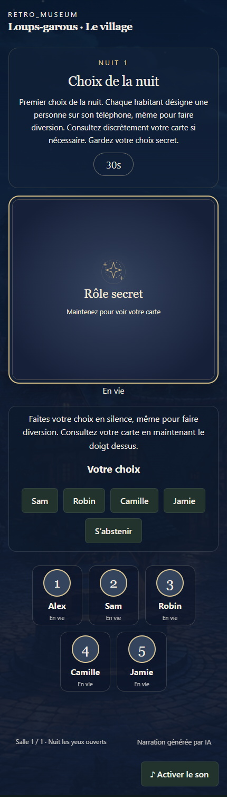

# Werewolves · The village

A Retro Museum activity for 4–16 players, in English, French and Tagalog. Automatic narration, several nights, private held role cards and an eyes-open night variant.

[Retro Museum on Nexlink](https://nexlink.ph/p/retro-museum) · [Creator toolkit](https://github.com/manaty/retro-museum-sdk)

## A look inside the village

### The shared display · night


In the eyes-open variant, every player appears to make a night choice on their phone. Only the relevant secret role affects the real outcome.

### The shared display · day


The village changes with the day/night cycle. The software narrator handles the phases, discussion time and voting.

### The player's phone



Press and hold the card to reveal your role; release it to hide it again. The phone can use a different language from the shared display. Captures show a demonstration with fictional player profiles, using the packaged game interface.

## Play on your own server

```sh
npm ci
npm run build
npm start
```

Open [localhost:4311](http://localhost:4311), click **Play now**, and scan the displayed QR with each phone. On Wi-Fi, set `PUBLIC_ORIGIN` to the computer's reachable address, such as `http://192.168.1.10:4311`. In production use its HTTPS origin. `PORT` and `DATA_DIR` are configurable.

The room organiser can start, pause and end the game; players can replay. Profiles, cropped avatars and phone language are saved in the browser. Late arrivals play in the next match. Game logic is authoritative on the server, and private roles/cards never appear on the shared display.

## Build

```sh
npm ci --ignore-scripts
npm run build
npm test
```

The committed `dist/game.rmg.json` is the versioned package for the [Retro Museum marketplace](https://github.com/manaty/retro-museum-marketplace), following the [SDK contract](https://github.com/manaty/retro-museum-sdk). The game engine is also exported as `@manaty/game-werewolf/engine` and is used by Retro Museum. This repository also includes its complete browser interface and can run without the museum. The official prevalidation Action checks the package on every push.

## Attribution

Code and bundled assets: Manaty, MIT. Village artwork and prerecorded narration were generated with AI for this project; narration uses OpenAI's preset marin voice. No API call is needed during gameplay. No copyrighted commercial ROM is included.

## Rules

The narrator runs reveal, night actions, dawn, debate and voting. Late arrivals spectate until replay. At four: one wolf, one seer, two villagers. A witch joins the deck from five players, a hunter from six. Each fresh match shuffles roles independently.
